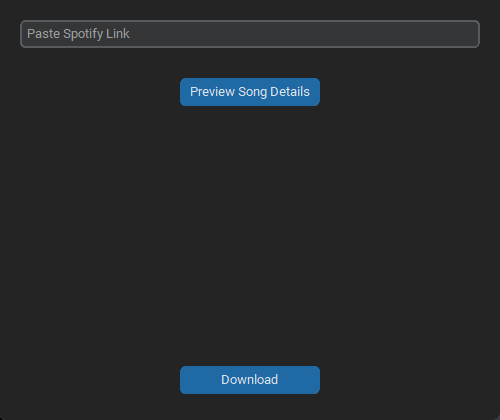

# myMusic

myMusic is a desktop app that uses Spotify track, playlist, and album links to find matching songs and save them as local MP3 files.



Paste a Spotify track, playlist, or album link, preview the queued song details, then download the matched tracks as MP3 files.

## Educational Use And Download Rights

myMusic is provided for educational purposes only. Use it only to download content that you own or otherwise have the legal right and permission to download. You are responsible for following applicable copyright laws and the terms of service of the content platforms you use.

## Platform Support

| Platform | Status | Download |
| --- | --- | --- |
| Windows | Supported | `myMusic-v1.4.0-windows-setup.exe` from GitHub Releases |
| Linux x64 | Experimental | `myMusic-v1.4.0-linux-x64.tar.gz` from GitHub Releases |
| Linux ARM64 | Experimental | `myMusic-v1.3.0-linux-arm64.tar.gz` from GitHub Releases |
| macOS | Not supported yet | N/A |

## Download And Install

Download myMusic from the [GitHub Releases page](https://github.com/cluelessfr/myMusic/releases).

You do not need to install Python, project dependencies, FFmpeg, Deno, or developer tools. The release files include the executable and the files the app needs to run.

### Windows

The recommended Windows download is the installer.

1. Download `myMusic-v1.4.0-windows-setup.exe`.
2. Open the downloaded installer.
3. Follow the setup steps.
4. Launch myMusic from the installer, Start Menu, or desktop shortcut if you selected one.

For v1.4.0, Windows is distributed as the installer.

### Linux x64

The Linux x64 build is experimental. It is for typical Intel and AMD Linux PCs, not Raspberry Pi or other ARM64 devices.

1. Download `myMusic-v1.4.0-linux-x64.tar.gz`.
2. Extract the downloaded archive.
3. Open the extracted `myMusic` folder.
4. Run the `myMusic` executable inside that folder.

From a terminal, you can run:

```text
tar -xzf myMusic-v1.4.0-linux-x64.tar.gz
cd myMusic
./myMusic
```

### Linux ARM64

The Linux ARM64 build is experimental and was tested on 64-bit Raspberry Pi OS. It is for ARM64 Linux devices such as a 64-bit Raspberry Pi, not typical Intel or AMD Linux PCs.

1. Download `myMusic-v1.3.0-linux-arm64.tar.gz`.
2. Extract the downloaded archive.
3. Open the extracted `myMusic` folder.
4. Run the `myMusic` executable inside that folder.

From a terminal, you can run:

```text
tar -xzf myMusic-v1.3.0-linux-arm64.tar.gz
cd myMusic
./myMusic
```

## Windows SmartScreen

Windows may show a SmartScreen warning because myMusic is a new unsigned app from an independent developer. This does not automatically mean the app is unsafe. It means Windows does not recognize the app yet because it is not code-signed with a trusted certificate and has not built a download reputation.

Only bypass SmartScreen if you downloaded myMusic from the official GitHub Releases page.

To continue:

1. Click **More info**.
2. Check that the app name is `myMusic`.
3. Click **Run anyway**.

## How To Use myMusic

1. Open myMusic.
2. Paste a Spotify track, playlist, or album link into the text box.
3. Click **Preview Song Details**.
4. Check that the queued titles, artists, and albums look right.
5. Click **Download Song**.
6. Open the finished MP3 files from your selected output folder.

## App Updates

myMusic includes a **Check For App Updates** button.

On Windows, myMusic downloads the newer installer and starts it for you. On Linux, myMusic downloads the newer archive and tells you to install it manually by replacing the extracted app folder.

## Known Issue: YouTube Bot Check

myMusic uses YouTube Music and regular YouTube through yt-dlp to find and download matching audio. Sometimes YouTube blocks automated requests and shows a "Sign in to confirm you're not a bot" error.

This is a YouTube-side anti-bot check, not an installation problem with myMusic. If it happens, myMusic shows a clearer bot-check message instead of raw technical download details. Try again later or from a different network. This version does not ask for your YouTube account or browser cookies.

## Uninstall

The Windows installer includes an uninstaller.

You can uninstall myMusic from:

- Windows Settings > Apps > Installed apps.
- The Start Menu entry named **Uninstall myMusic**.

For Linux x64 and Linux ARM64, delete the extracted `myMusic` folder.

## What The App Does

For a Spotify track, playlist, or album link, myMusic:

- Reads and cleans the Spotify link.
- Gets the track title, artists, album, and other metadata.
- Searches YouTube Music and regular YouTube for matching results.
- Downloads the selected audio.
- Converts it to MP3.
- Adds title, artist, album, and cover artwork tags when available.
- Saves the MP3 to your selected output folder.

## Where The Processing Happens

myMusic runs on your computer.

The GitHub Release page only hosts the download. After you download and run myMusic, the lookup, download, conversion, tagging, and file saving happen locally on your machine.

```text
GitHub Release page -> download release file -> install or extract myMusic -> run myMusic -> MP3 saved locally
```

## Not Finished Yet

- A built-in workaround for occasional YouTube bot checks.

## License

The myMusic source code is available under the [MIT License](LICENSE). The software is provided "as is," without warranty of any kind.

The MIT License applies to the source code. The educational-use and download-rights notice above describes the intended responsible use of myMusic: use it only to download content that you own or otherwise have the legal right and permission to download.
